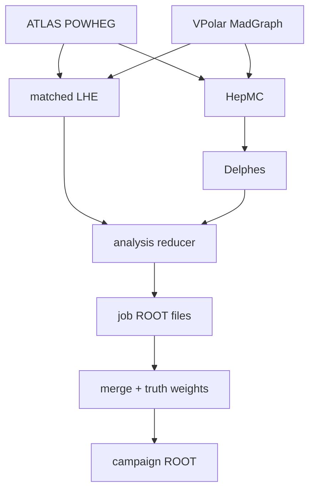

# Off-shell angular production

This repository builds matched off-shell $ZZ\to e^-e^+\mu^-\mu^+$ samples
from either ATLAS event generation or standalone VPolarized MadGraph through a compact angular-analysis ROOT tree. It is
adapted for the UChicago Analysis Facility and combines the production pattern
of
[FourLeptonUnfolding](https://github.com/rafaellopesdesa/FourLeptonUnfolding)
with the Born-projected conventions of
[offshell_angular_coefficients](https://github.com/rafaellopesdesa/offshell_angular_coefficients).



The production modes are:

| Sample | Hard process | Generation phase space |
|---|---|---|
| `gg4l` | full Higgs + continuum + interference, exclusive `2e2mu` | $50\leq m_{\ell\ell}\leq200$ GeV, $150\leq m_{4\ell}\leq3000$ GeV |
| `qqZZ` | quark-initiated continuum, exclusive `2e2mu` | $m_{\ell\ell}\geq50$ GeV, $150\leq m_{4\ell}\leq3000$ GeV at LHE level |
| `vpolar_LL/TT/TL/LT` | full loop-induced Higgs + continuum + interference in a fixed polarization channel, exclusive `2e2mu` | $50\leq m_{\ell\ell}\leq200$ GeV, $150\leq m_{4\ell}\leq3000$ GeV |

Every generation configuration requests the exclusive `2e2mu` state and uses
Pythia8. Herwig is not part of the chain.

## Repository map

| Path | Purpose |
|---|---|
| `Generation/` | Common dispatcher, ATLAS cards, and standalone VPolar backend |
| `Simulation/` | Pinned, patched Delphes response with dressed and RECO leptons |
| `Analysis/` | Strict LHE/Delphes matcher and compact ROOT writer |
| `Merging/` | Cross-section-safe campaign merger and LHE truth angular weights |
| `src/offshell_production/` | Shared Born projection, angles, LHE parsing, and selection |
| `Workflow/` | One-job end-to-end worker used locally and by HTCondor |
| `UChicagoAF/` | UChicago runtime guidance, container wrapper, and Condor campaigns |
| `docs/physics-conventions.md` | Authoritative physics and event-identity contract |

## Quick start on the UChicago AF

Install the small analysis environment in a clean shell:

```bash
uv sync --frozen --extra test
source .venv/bin/activate
```

Build Delphes once in the ROOT environment chosen for simulation:

```bash
Simulation/install_delphes.sh --prefix /data/$USER/software/offshell-delphes
source Simulation/env.sh
```

Prepare one reusable POWHEG integration-grid archive per process on a compute
node or batch allocation. This is the expensive bootstrap step:

```bash
Generation/prepare_gridpack.sh gg4l \
  --events 50 --seed 101 \
  --output-dir /data/$USER/offshell/gridpacks/gg4l

Workflow/run_chain.sh gg4l \
  --events 2 --seed 102 --job-id 0 --campaign-id 20260902 \
  --gridpack /data/$USER/offshell/gridpacks/gg4l/integration_grids.tar.gz \
  --output-dir /data/$USER/offshell/smoke/gg4l_job0
```

For polarized samples, build the shared generator stack once and then prepare
an independent native MadGraph gridpack for each required polarization:

```bash
Generation/VPolar/install_vpolar.sh \
  --prefix /data/$USER/offshell/software/vpolar \
  --lhapdf-config /path/to/lhapdf-config --cores 8

Generation/prepare_gridpack.sh vpolar_LL \
  --generator-prefix /data/$USER/offshell/software/vpolar \
  --seed 201 --cores 8 \
  --output-dir /data/$USER/offshell/gridpacks/vpolar_LL

Workflow/run_chain.sh vpolar_LL \
  --events 2 --seed 202 --job-id 0 --campaign-id 20260902 \
  --generator-prefix /data/$USER/offshell/software/vpolar \
  --gridpack /data/$USER/offshell/gridpacks/vpolar_LL/vpolar_LL_gridpack.tar.gz \
  --output-dir /data/$USER/offshell/smoke/vpolar_LL_job0
```

Gridpacks remove repeated integration, not hard-event evaluation, showering,
simulation, or analysis. POWHEG packs are integration-grid archives and still
require the pinned AthGeneration environment. VPolar packs use MadGraph's
native frozen-grid mode and still require the exact validated shared prefix
for the bound installation plus the LHAPDF and Pythia runtimes. VPolar gridpack
execution is serial; parallel cores are useful while preparing the pack, not
while consuming it. Multi-job Condor campaigns require a compatible pack and
validate it before creating any submission files. A one-job gridless run
remains available for smoke tests and diagnosis.

Each stage also has a standalone runner and detailed README. The default
generation release is `AthGeneration 23.6.41`; its transform writes EVNT,
HepMC, and the POWHEG LHE sidecar. Before Pythia, both job options enforce their
LHE-level four-lepton range and add the technical weights
`AUX_OAP_EVENT_ID` and `AUX_OAP_EVENT_UNIT`. `Generation/align_lhe_events.py`
recovers the exact source ID from their HepMC ratio and publishes
`events.matched.lhe.gz` with exactly the showered events in HepMC order. Source
IDs may contain gaps, so Pythia skips and retries do not turn into an incorrect
prefix match.

The compact `Events` tree retains every matched source event. It contains
signed LHE weights, raw and Born-projected lepton four-vectors, kinematics, and
helicity angles independently at LHE, dressed, and RECO level. Missing RECO
candidates remain as rows with false masks and `NaN` RECO values. The
`reconstructed` flag applies the strict off-shell RECO selection, including
both $50<m_Z<106$ GeV windows and $m_{4\ell}>180$ GeV.
There is no upper RECO $m_{4\ell}$ cut.

After producing several job outputs, `Merging/merge_analysis_outputs.py`
combines them without changing the raw signed `weight_lhe` branch. It pools the
generator normalization primitives, adds a directly histogrammable nominal
weight whose sum is the filtered cross section, and evaluates the requested
symmetric angular projectors from the Born-projected LHE helicity angles. See
`Merging/README.md` for the merge command and exact branch definitions.

## Important qqZZ matching note

POWHEG's `ZZ` interface exposes the dilepton lower cut but no native four-lepton
mass limits. The local job option therefore filters the completed hard-event
LHE stream to $150\leq m_{4\ell}\leq3000$ GeV **before** Pythia and records
generated/accepted counts, signed sums, absolute-weight sums, and both filter
efficiencies in `lhe-contract-metadata.json`. No post-shower Athena filter is
used. The 150 GeV lower edge aligns qqZZ with the gg4l and VPolar generation
phase space; both bounds are enforced and recorded.
The qqZZ card doubles PowhegControl's standard 10% LHE safety stream to provide
headroom for this active filter. Since POWHEG `ZZ` has no native $m_{4\ell}$
cut, the savings begin at Pythia and continue through simulation and analysis.

For the required POWHEG `IDWTUP=-4` strategy, normalization is derived before
showering from the signed LHE weights: the filtered cross section is the sum of
accepted weights divided by the number of generated events, with rejected
events treated as zero. `Runs` carries this value, its finite-sample MC error,
and the primitive counts and weight moments needed to pool jobs correctly.
Running cross-section fields carried through HepMC and Delphes remain separate
diagnostics.

Normal AF outputs should be placed under `/data/$USER`, as in the example
above. The repository-local `Generation/runs/...` and `Workflow/runs/...`
defaults are intended only for smoke tests and other small jobs.

After local smoke tests, `UChicagoAF/condor/submit_campaign.py` prepares
deterministic shared-filesystem HTCondor campaigns. It supports all six sample
names, gives jobs disjoint seeds and event-number ranges, requires a compatible
gridpack whenever `--jobs` is greater than one, and requires the shared VPolar
prefix for polarized modes. See `UChicagoAF/condor/README.md`.

## Tests

The unit tests require neither Athena nor ROOT:

```bash
uv run --frozen --extra test python -m pytest -q
bash -n Generation/*.sh Generation/VPolar/*.sh Simulation/*.sh \
  UChicagoAF/*.sh UChicagoAF/condor/*.sh Workflow/*.sh
```

Full `Gen_tf.py` and Delphes smoke tests must run on the UChicago AF with CVMFS
and ROOT available.
