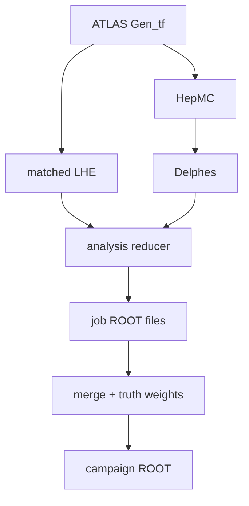

# Off-shell angular production

This repository builds matched off-shell \(ZZ\to e^-e^+\mu^-\mu^+\) samples
from ATLAS event generation through a compact angular-analysis ROOT tree. It is
adapted for the UChicago Analysis Facility and combines the production pattern
of
[FourLeptonUnfolding](https://github.com/rafaellopesdesa/FourLeptonUnfolding)
with the Born-projected conventions of
[offshell_angular_coefficients](https://github.com/rafaellopesdesa/offshell_angular_coefficients).



The two production modes are:

| Sample | Hard process | Generation phase space |
|---|---|---|
| `gg4l` | full Higgs + continuum + interference, exclusive `2e2mu` | \(50\leq m_{\ell\ell}\leq200\) GeV, \(150\leq m_{4\ell}\leq3000\) GeV |
| `qqZZ` | quark-initiated continuum, exclusive `2e2mu` | \(m_{\ell\ell}\geq50\) GeV, \(70\leq m_{4\ell}\leq3000\) GeV at LHE level |

Both job options request the exclusive `2e2mu` state and use Pythia8. Herwig
is not part of the chain.

## Repository map

| Path | Purpose |
|---|---|
| `Generation/` | Local ATLAS job options and common `Gen_tf.py` runner |
| `Simulation/` | Pinned, patched Delphes response with dressed and RECO leptons |
| `Analysis/` | Strict LHE/Delphes matcher and compact ROOT writer |
| `Merging/` | Cross-section-safe campaign merger and LHE truth angular weights |
| `src/offshell_production/` | Shared Born projection, angles, LHE parsing, and selection |
| `Workflow/` | One-job end-to-end worker, ready to wrap with HTCondor later |
| `UChicagoAF/` | UChicago storage/environment guidance and container wrapper |
| `docs/physics-conventions.md` | Authoritative physics and event-identity contract |

## Quick start on the UChicago AF

Install the small analysis environment in a clean shell:

```bash
uv sync --frozen --extra test
source .venv/bin/activate
```

Build Delphes once in the ROOT environment chosen for simulation:

```bash
Simulation/install_delphes.sh --prefix /data/$USER/software/offshell-delphes
source Simulation/env.sh
```

Then run a small end-to-end validation job:

```bash
Workflow/run_chain.sh gg4l \
  --events 2 --seed 101 --job-id 0 --campaign-id 20260902 \
  --output-dir /data/$USER/offshell/smoke/gg4l_job0
```

Each stage also has a standalone runner and detailed README. The default
generation release is `AthGeneration 23.6.41`; its transform writes EVNT,
HepMC, and the POWHEG LHE sidecar. Before Pythia, both job options enforce their
LHE-level four-lepton range and add the technical weights
`AUX_OAP_EVENT_ID` and `AUX_OAP_EVENT_UNIT`. `Generation/align_lhe_events.py`
recovers the exact source ID from their HepMC ratio and publishes
`events.matched.lhe.gz` with exactly the showered events in HepMC order. Source
IDs may contain gaps, so Pythia skips and retries do not turn into an incorrect
prefix match.

The compact `Events` tree retains every matched source event. It contains
signed LHE weights, raw and Born-projected lepton four-vectors, kinematics, and
helicity angles independently at LHE, dressed, and RECO level. Missing RECO
candidates remain as rows with false masks and `NaN` RECO values. The
`reconstructed` flag applies the strict off-shell RECO selection, including
both \(50<m_Z<106\) GeV windows and \(m_{4\ell}>180\) GeV.
There is no upper RECO \(m_{4\ell}\) cut.

After producing several job outputs, `Merging/merge_analysis_outputs.py`
combines them without changing the raw signed `weight_lhe` branch. It pools the
generator normalization primitives, adds a directly histogrammable nominal
weight whose sum is the filtered cross section, and evaluates the requested
symmetric angular projectors from the Born-projected LHE helicity angles. See
`Merging/README.md` for the merge command and exact branch definitions.

## Important qqZZ matching note

POWHEG's `ZZ` interface exposes the dilepton lower cut but no native four-lepton
mass limits. The local job option therefore filters the completed hard-event
LHE stream to \(70\leq m_{4\ell}\leq3000\) GeV **before** Pythia and records
generated/accepted counts, signed sums, absolute-weight sums, and both filter
efficiencies in `lhe-contract-metadata.json`. No post-shower Athena filter is
used. The 70 GeV lower edge is kinematically redundant once both generated
dileptons exceed 50 GeV, but the bound is still enforced and recorded.

For the required POWHEG `IDWTUP=-4` strategy, normalization is derived before
showering from the signed LHE weights: the filtered cross section is the sum of
accepted weights divided by the number of generated events, with rejected
events treated as zero. `Runs` carries this value, its finite-sample MC error,
and the primitive counts and weight moments needed to pool jobs correctly.
Running cross-section fields carried through HepMC and Delphes remain separate
diagnostics.

Normal AF outputs should be placed under `/data/$USER`, as in the example
above. The repository-local `Generation/runs/...` and `Workflow/runs/...`
defaults are intended only for smoke tests and other small jobs.

HTCondor submission is intentionally the next layer, after the local AF smoke
jobs establish the exact runtime combination. `Workflow/run_chain.sh` is
already structured as its non-interactive worker executable.

## Tests

The unit tests require neither Athena nor ROOT:

```bash
uv run --frozen --extra test python -m pytest -q
bash -n Generation/*.sh Simulation/*.sh UChicagoAF/*.sh Workflow/*.sh
```

Full `Gen_tf.py` and Delphes smoke tests must run on the UChicago AF with CVMFS
and ROOT available.
